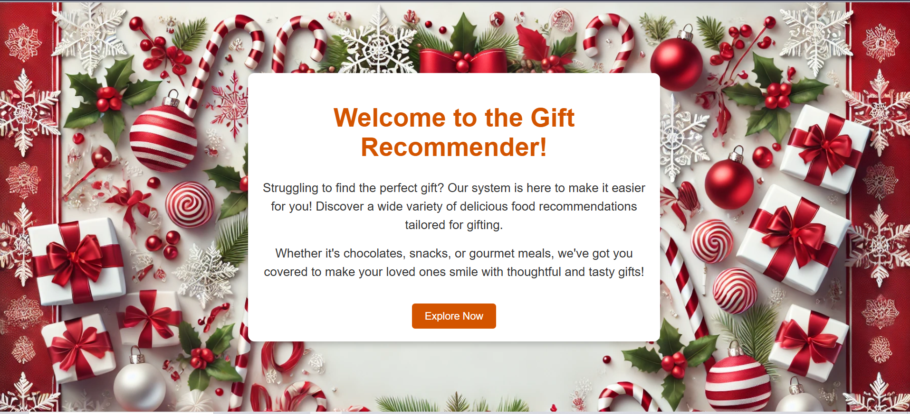
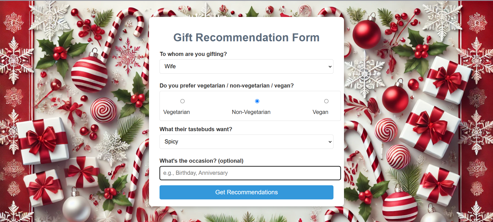
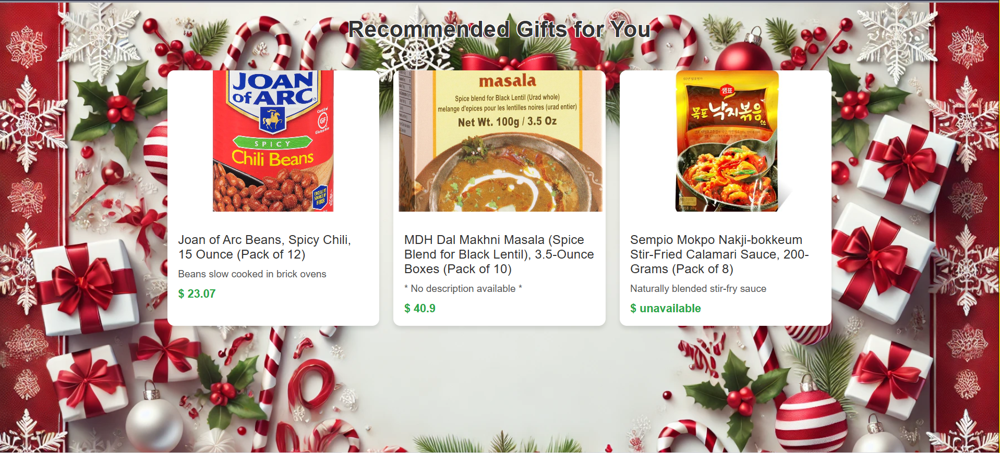

# Gift Recommendation App

## Description

The **Gift Recommendation App** is a Flask-based web application designed to provide personalized product recommendations based on user input. Users can fill out a form describing a recipient's preferences, and the app generates product suggestions based on the recipient's food preferences, taste, and occasion. The app uses a recommendation engine to fetch products and display their details. Behind the recommendation engine, there is a **Machine learning model**, which utilizes the concept of cosine similarity to match the best products to your interests.

### Features:
- Input form for recipient details, food preferences, taste, and occasion.
- Personalized product recommendations based on user input.
- Error handling for rate limits and unexpected errors during product detail fetching.
- A simple, user-friendly web interface with Flask templates.

## Table of Contents
1. [Installation](#installation)
2. [Usage](#usage)
3. [Error Handling](#error-handling)
4. [Contributing](#contributing)

---

## Installation

Follow these steps to get your environment set up and run the application locally:

### Prerequisites

Ensure that you have the following installed on your system:
- Python 3.x
- Pip (Python package installer)

### Steps

1. **Clone the repository:**

   ```bash
   git clone https://github.com/devkverma/gift-recommendation-app.git
   ```

2. **Navigate to the project directory:**

   ```bash
   cd gift-recommendation-app
   ```

3. **Create a virtual environment (optional but recommended):**

   ```bash
   python3 -m venv venv
   ```

4. **Activate the virtual environment:**

   - For macOS/Linux:

     ```bash
     source venv/bin/activate
     ```

   - For Windows:

     ```bash
     venv\Scripts\activate
     ```

5. **Install dependencies:**

   Install the required Python packages:

   ```bash
   pip install -r requirements.txt
   ```

6. **Run the Flask app:**

   Start the Flask server:

   ```bash
   python app.py
   ```

7. The app will be accessible at `http://127.0.0.1:5000/` in your browser.

---

## Usage

1. **Navigate to the homepage:**

   Open your browser and go to [http://127.0.0.1:5000/](http://127.0.0.1:5000/).

2. **Fill out the form:**

   You will be directed to the form page at `/app`, where you can input:
   - **Recipient**: Who the product is for.
   - **Food Preference**: The type of food they prefer.
   - **Taste**: The flavor profile (mild, spicy, etc.).
   - **Occasion**: A specific occasion like birthday, anniversary, etc.

3. **Get recommendations:**

   After submitting the form, the app will generate personalized product recommendations. The recommendations are based on the details you provided, and the app will display them on the results page.

4. **Error Handling:**

   If there is an issue with fetching product details (e.g., rate limits or errors), the app will direct you to an appropriate error page:
   - **Rate Limit Error**: If too many requests are made to the product detail API, the app will inform the user of how long to wait before retrying.
   - **Unexpected Error**: If there is an issue with fetching product details, an error message will be shown.

---

## Error Handling

### Rate Limit
If the app hits a rate limit while fetching product details, it will display a message with the number of seconds remaining before the next request can be made.

### Unexpected Error
If there is an unexpected error while fetching product details, the app will display an error message with details.

---
## Screenshots
This is the home page.


This is the form page.


This is the recommendation page.

---

## Contributing

We welcome contributions! If you'd like to contribute to this project, please follow the steps below:

1. **Fork the repository** on GitHub.
2. **Clone your fork** to your local machine.
3. **Create a new branch** (`git checkout -b feature-branch`).
4. **Make your changes**.
5. **Commit your changes** (`git commit -am 'Add new feature'`).
6. **Push to the branch** (`git push origin feature-branch`).
7. **Create a pull request** to merge your changes.

Please ensure that your code follows the project’s coding conventions, and consider adding tests for new features.

---


### Project Structure

```
.
├── app.py               # Main Flask app
├── requirements.txt     # Project dependencies
├── scripts/             # Custom scripts for product recommendation
│   ├── recommend.py     # Recommendation logic
│   ├── product_details.py  # Fetch product details
├── templates/           # HTML templates for rendering pages
│   ├── index.html      # Homepage template
│   ├── form.html       # Form page template
|   ├── rate_limit.html # API limit exceed template
|   ├── unexpected_error.html  # Unexpected error template
│   └── recommend.html  # Recommendation result page template
├── static/              # Static files (CSS)
├── notebook/             # Jupyter notebook for model creation

```

